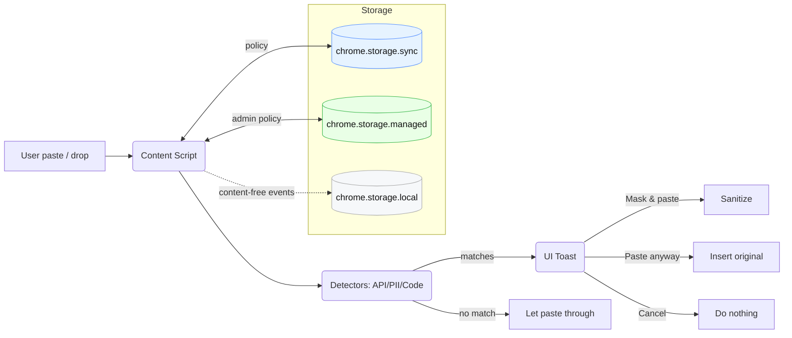
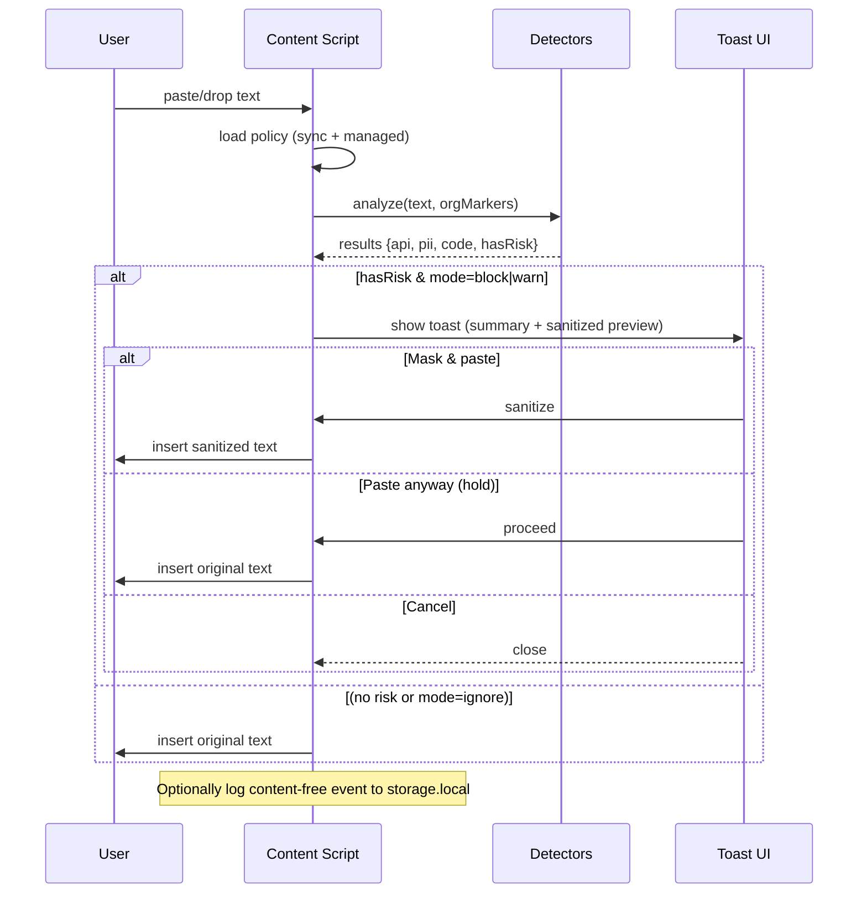

# Architecture

SnipGuard is a privacy-first, on-device browser extension that intercepts pastes (and optionally file drops) before content lands in AI chat inputs. It runs entirely in the page context—no network calls, no telemetry by default.

## High-level components



## Files & responsibilities

- src/content.js
  - Hooks: paste, drop, change (<input type=file>) on target sites.
  - Loads policy from chrome.storage.sync and merges admin policy from chrome.storage.managed (if present).
  - Calls detectors and decides: block, warn, ignore (per-site mode).
  - Inserts text into textarea/input/contentEditable (Shadow DOM-aware as we improve).
  - Emits content-free audit events (optional).
- src/detectors.js
  - Deterministic regex signatures for API keys, PEM blocks, etc.
  - PII checks (email, E.164 phone, credit card Luhn, IBAN Mod-97).
  - Code heuristics (line count, keywords, config files), org markers.
  - Entropy fallback for unknown secrets.
  - sgSanitize() performs shape-preserving redaction.
- src/ui.js + src/ui.css
  - Lightweight toast/modal.
  - Actions: Mask & paste, Paste anyway (hold-to-confirm), Cancel.
  - Optional: require justification text for bypass (policy-controlled).
- sw.js (service worker)
  - First-run defaults and lightweight upgrade tasks.
  - (No network, no alarms, keep minimal.)
- options.html + options.js
  - User settings: block types, allowlist, org markers, per-site modes.
  - Shows read-only badges for managed (admin-locked) fields.
- Storage
  - chrome.storage.sync: user settings.
  - chrome.storage.managed: admin policy (read-only, optional).
  - chrome.storage.local: content-free audit ring buffer (optional).
- Tests & tooling
  - tests/*.spec.mjs: minimal runner (VM-execs detectors.js).
  - .github/workflows/*: CI, release packaging.

## Data Flows


## Policy model
SnipGuard merges three layers (lowest → highest precedence):
1. Defaults (hardcoded safe values in content.js)
2. User settings (chrome.storage.sync)
3. Managed policy (chrome.storage.managed) — authoritative

Managed keys may include: blockOn, modeByHost, orgMarkers, customPatterns[], bypass.{allowed,holdMs,requireReason}, logging.{enabled,contentFree,maxEvents}. If a key is present in managed policy, Options UI shows it as locked (read-only).

## Detection pipeline
1. Cheap signatures first: regex checks for known providers (OpenAI, GitHub PAT, Stripe, Slack, AWS AKID, Google API keys, Telegram bot, Twilio, etc.).
2. PII validators: email, E.164 phone, credit card Luhn, IBAN Mod-97 (plus optional country length).
3. Code heuristics: line count threshold + language/config markers; org markers and license headers escalate.
4. Entropy fallback: high-entropy substrings (e.g., base64/hex) > N chars with Shannon H > 3.2.
5. Rate-limit & chunked pastes: short-window buffer to catch multi-step leaks.
6. Sanitization: shape-preserving replacement for recognized secrets (sk_live_… → sk_live_[REDACTED]), generic [[REDACTED_*]] otherwise.

Design goal: prioritize precision for secrets; avoid blocking false positives. Users can always Mask & paste.

## Privacy & security
- Zero exfiltration: no network calls; all checks run locally.
- Minimal permissions: storage, scripting, and broad hosts (or tighten if you pre-scope).
- Audit log (optional): content-free events only (counts, host, action). Exportable by user/admin.
- Bypass governance: hold-to-confirm; optionally require a short justification (stored content-free).
- Supply-chain: signed releases, SBOM, CodeQL (see release hardening workflow).

## Performance notes
- Content script loads tiny code paths; detectors are string/regex only.
- Incremental %97 for IBAN avoids bigints.
- Entropy runs after deterministic matches; cap candidate count on very large pastes.
- UI toast is a single DOM node; removed after action.

## Extensibility
### Add a new detector (provider)
1. Edit src/detectors.js by adding a regex to SG_RE with a clear key:

```
// Cloudflare API token (context-scoped)
cloudflare: /(?<=cf_token[:=]\s*)[A-Za-z0-9_-]{40}/g
```

2. If feasible, add a validator (checksum/structure).
3. Update sgSanitize to preserve prefix for recognizable tokens.
4. Add tests in tests/*.spec.mjs with synthetic samples.
4. Update documentation (README, DETECTOR_GUIDE.md if present).

### Per-site modes
- modeByHost: block | warn | ignore.
- Apply defaults: public AI → block, docs → warn, localhost/dev → ignore.

### Enterprise features (optional)
- Managed policy—use chrome.storage.managed merge.
- Bypass with justification—UI text input gating “Paste anyway”.
- Content-free audit events—ring buffer in storage.local with JSON export.

## Error handling

DOM failures (exotic editors): fall back to document.execCommand('insertText', ...) or show “copy sanitized to clipboard”.

Storage errors: continue with defaults; surface a non-blocking toast message in Options only.

Regex catastrophes: avoid backtracking traps; prefer linear-time patterns.

## Build, test, release
- Load unpacked (dev): chrome://extensions.
- Tests: npm test runs lightweight VM tests (no deps).
- CI: runs tests and uploads a ZIP artifact on PRs.
- Release: tag vX.Y.Z → GitHub Release with zip + checksum (optionally SBOM, signatures).

## Threat model (scoped)

### In scope
- Accidental/naïve leaks via paste or file drop.
- Common secret types, obvious PII, heuristic “code”.

### Out of scope
-Intentional exfiltration, steganography, novel encoding tricks.
- OCR of screenshots, images, or PDFs (future enhancement).
- IDE/browser outside supported editors/inputs.

## Glossary
- DLP (Data Loss Prevention): Controls that prevent sensitive data from leaving a boundary.
- PII: Personally Identifiable Information.
- Managed policy: Admin-pushed settings via enterprise/MDM (read-only to users).

## Appendix: Key entry points
- document.addEventListener('paste', sgHandlePaste, true)
- document.addEventListener('drop', /* optional */, true)
- window.SG.sgDetectAll(text, orgMarkers)
- window.SG.sgSanitize(text, results)

chrome.storage.sync / managed / local
