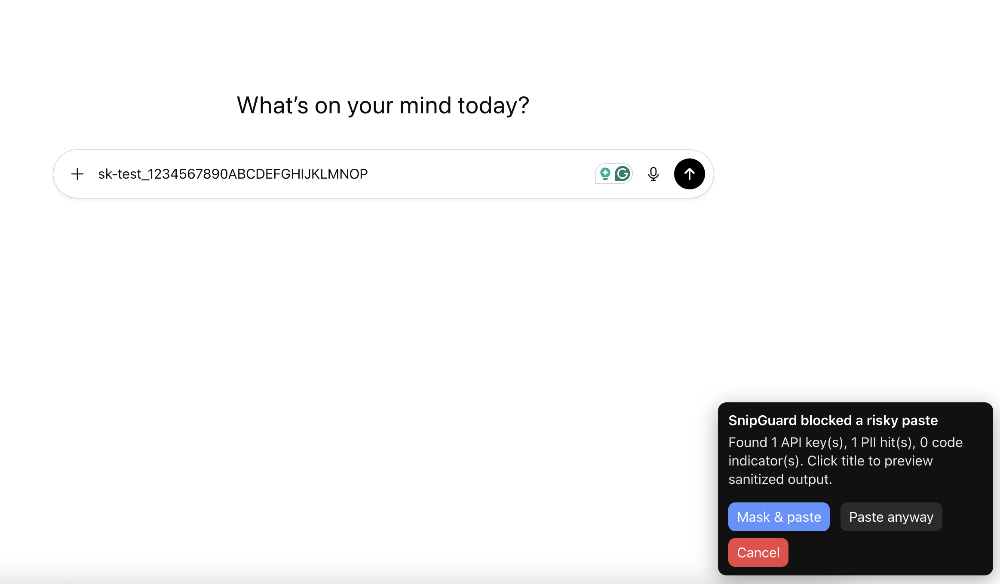

# SnipGuard - Paste protection for AI prompts (MVP)

**SnipGuard** is a lightweight, on‑device “DLP for prompts.” It detects and warns (or blocks) when you paste **API keys**, **PII**, or **proprietary code** into ChatGPT and other AI tools — before the text lands in the input. All detection runs **locally**; no content leaves your machine.

## Demo

> Example on an AI prompt box: SnipGuard detects an API key and PII before the text is shared.

## Features (MVP)
- Pre‑paste interception on ChatGPT, Claude, Gemini, Copilot, Perplexity, Poe.
- API key signatures + entropy catch‑all.
- PII checks (email, phone, IBAN, credit card with Luhn).
- Proprietary code heuristics + org markers.
- “Mask & paste” automatic redaction.
- Per‑site modes (block / warn / ignore), allowlist, and custom org markers.
- Zero telemetry by default.

## Install (developer mode)
1. Download the latest release zip or build from source.
2. Open **chrome://extensions** → enable **Developer mode**.
3. Click **Load unpacked** and select the `snipguard/` folder.
4. Visit chat.openai.com and try pasting a test secret to see the warning.

## Privacy
SnipGuard processes text **only in-page**, does not send it anywhere, and stores settings via Chrome Sync. No logs or analytics are collected by default.

## Contributing
- Add detectors in `src/detectors.js` (keep regex simple and well‑commented).
- Add unit tests (planned) and fixtures (synthetic data only).
- See `CONTRIBUTING.md` and `SECURITY.md` for details.

## Roadmap
- File‑upload scanning (drag/drop to AI sites).
- Firefox/Edge builds.
- Local small model to reduce false positives for code.
- Admin policy import (JSON).

## License
Apache-2.0 — see `LICENSE`.
